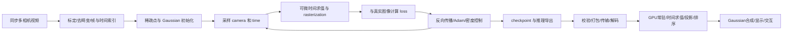

# 从视频到 4D Gaussian 像素

## 先区分表示

| 表示 | 存什么 | 渲染需要什么 | 是否与本项目兼容 |
| --- | --- | --- | --- |
| 点云 | xyz、可选颜色/法线 | 点/圆盘的绘制规则 | 否，缺少协方差、opacity 与时间参数 |
| 静态 3DGS | 均值、尺度、旋转、opacity、SH 等 | 投影椭圆、深度排序、alpha | 需专用 loader；同为 PLY 也不够 |
| HUST 4DGS | canonical Gaussians + 时空特征与变形网络 | 在 t 评估 deformation，再 rasterize | 否；仅复制 PLY 会丢动态行为 |
| STG-Lite | 显式时间 opacity、三次平移、旋转变化、RGB | 时间求值后 splat | **本项目主线** |
| STG-Full | 时空 Gaussian + 特征与颜色 decoder | 额外 feature/decoder 路径 | 否，不是 Lite 的三个 RGB 字段 |
| Dynamic 3D Gaussians | 持续跟踪的 Gaussian 与随帧更新的姿态 | 轨迹/帧数据读取与合成 | 需独立时间与资产契约 |

来源：[3DGS 原始项目](https://repo-sam.inria.fr/fungraph/3d-gaussian-splatting/)、[HUST 4DGS 官方实现](https://github.com/hustvl/4DGaussians)、[STG 官方实现](https://github.com/oppo-us-research/SpacetimeGaussians)、[Dynamic 3D Gaussians](https://github.com/JonathonLuiten/Dynamic3DGaussians)。不要把“4D”理解成某个统一的 `.4d` 文件。

## 全流程与各阶段的产物



### 1. 采集、同步与标定

同一时间的多个机位为场景提供几何约束。输入不仅是视频，还包括每帧时间戳、曝光、分辨率、镜头模型、相机内外参。不同机位若差一帧，快速运动物体在各视角位置不一致，优化可能把同步错误“解释”为厚重、重复或漂浮的几何。

相机模型：`p_cam = R_wc p_world + t_wc`；`u=fx*x/z+cx`，`v=fy*y/z+cy`。这里 `R_wc,t_wc` 表示 **world→camera**。相机中心 `C=-R_wc^T t_wc`，不是直接取 `t_wc`。

[COLMAP 官方格式](https://colmap.github.io/format.html) 的 `images` 保存 world→camera 姿态，四元数顺序 `qw qx qy qz`，相机轴是右、下、前。当前 fixture `cameras.json` 却是 camera→world rotation 与世界坐标位置。两种数据不能使用同一个“不加解释的 matrix”。

运动场景不能把所有时间的特征当作一个静态场景盲目 SfM。STG 的预处理利用已知相机与逐帧 triangulation 获得稀疏初始化，具体以 `script/pre_n3d.py` 和其 COLMAP 调用为准。相机固定并不意味着场景固定。

### 2. 初始化与参数

静态 Gaussian 可写为均值 `μ`、协方差 `Σ`、不透明度 `o`、颜色参数。一般数学写法 `Σ = R diag(s²) Rᵀ`；对 log-scale 做 exp，对 opacity logit 做 sigmoid，让尺度为正、opacity 在 0–1 内。不要直接优化一个任意 3×3 矩阵后假设它始终正定。

本项目对应的 CUDA/WGSL 矩阵布局以三条轴向量为准：`Σ = Σ_k a_k a_kᵀ`。论文符号中的 R 和内存里的行列矩阵可能互为转置；必须比较投影轴/协方差结果，不能只看公式名称。

STG-Lite 在 normalized time `t` 的公式：

```text
dt       = t - temporal_center
μ(t)     = μ0 + m1*dt + m2*dt² + m3*dt³
σt       = exp(log_temporal_scale)
w(t)     = exp(-(dt/σt)²)
αbase(t) = sigmoid(opacity_logit) * w(t)
q(t)     = normalize(q0 + dt*omega)
s        = exp(log_scale_xyz)
c        = RGB_direct
```

时间 RBF 的指数这里没有 `1/2`；屏幕上空间 Gaussian 的指数则有 `-1/2`。`omega` 是四个 quaternion-rate 系数，不是可直接交给刚体物理引擎的三维角速度。Lite 的 `f_dc_0..2` 是直接 RGB，不要套静态 3DGS 的 SH DC 变换。

### 3. 可微渲染与学习

训练时选择 `(camera,time)`，前向算出每个 splat 的位置、footprint、alpha 和颜色，再与观测图像比较。典型 photometric 目标为 `(1-λ)L1 + λ(1-SSIM)`，特定方法另有时间/几何正则，具体跟随配置与 `getloss`，不能把所有动态方法的正则混在一起。

`loss.backward()` 把像素误差传回几何、尺度、opacity、颜色和动态参数；优化器更新参数。官方 STG 时间多项式路径对部分 `dt` 使用 `detach()`，说明实际梯度路径由实现定义，不是拿纸面公式对所有量求导就等价。

密度控制改变表达能力：clone/split 为高误差区域增加 Gaussian，prune 删除无效或低 opacity 元素。它不是普通梯度下降自动产生的副作用；新增点还要正确初始化优化器状态、统计量和动态参数。不要把训练迭代数与视频帧数混为一谈。

训练内存除了 source 参数，还包括梯度、Adam 状态、可微 rasterizer 中间量和观测图像。能在手机显示某个模型，不能推出手机也能训练它。

### 4. 从 3D 椭球到 2D 椭圆

下面以 +Z 朝前的针孔相机坐标 `(x,y,z)` 写公式，忽略畸变。当前 WGSL 的 RH/-Z 视图通过完整投影矩阵处理符号，不要直接混用两套坐标：

```text
J = [ fx/z    0     -fx*x/z² ]
    [   0    fy/z   -fy*y/z² ]
Σcamera = Rview * Σworld * Rviewᵀ
Σscreen = J * Σcamera * Jᵀ + 0.3 I
```

`Σscreen` 是像素单位的 2×2 covariance。它的两个特征向量给出椭圆方向，特征值开方给出标准差。当前 shader 用 ±3σ 的 quad 覆盖 footprint，再在 fragment shader 计算 Gaussian。quad 是计算载体，不是四个独立点，也不是物理表面。

当前 `projected_axis()` 用齐次坐标求导：`d(clip.xy/clip.w) = (dclip.xy*clip.w - clip.xy*dclip.w)/clip.w²`。好处是相机投影包含在 `view_proj` 中，免得另写一套有符号差异的 J。

这是一阶近似。接近相机、极大 footprint、复杂遮挡与非线性畸变，都可能放大误差。当前 192 像素 sigma 上限及 1.35 NDC 中心剔除都是工程限制；后者**不是**任意大 Gaussian 的严格保守 bounds。

### 5. 排序与 alpha 合成

单个像素到投影中心的偏移为 d，`α = αbase exp(-0.5 dᵀ Σscreen⁻¹ d)`。当前阈值是 `<1/255` 丢弃，alpha 最大 0.99。

前向近到远的等价累积是：`C += T*α*c; T *= 1-α`，最后加 `T*background`。普通 graphics pipeline 使用远到近顺序和 premultiplied alpha：`Cout = Csrc + (1-αsrc)*Cdst`，其中 `Csrc=αsrc*csrc`。已经预乘颜色时再用 `SrcAlpha` 会乘两次，边缘变暗。

例如红、蓝两层都 α=0.5，黑背景：红在前得到 `(0.5,0,0.25)`；蓝在前得到 `(0.25,0,0.5)`。顺序不能随便换。

全局中心深度排序与 tile-local 排序可以使用相同的中心深度 key；tile 的价值还包括分桶、局部遍历与 early termination。不能简单说 tile-sort 自动解决所有相交 Gaussian 的逐像素顺序。两个实现还可能在 footprint、裁剪、平局顺序与提前终止上不同。

### 6. 导出与交付

训练 checkpoint 包含恢复训练所需状态；推理导出是另一种产品。至少记录 representation/version、字段与激活、坐标/单位、时间域、camera、颜色约定、decoder、bounds、checksum、数据划分与许可。PLY 本身只说明二进制字段，没有自动说明完整渲染语义。

当前 gzip 是整文件压缩：网络以流到达不代表能随机获取某时段模型。`02_Flames` 的 MSE 分片是 RGB 视频；它不证明 Gaussian 的随机访问、LOD 或模型 streaming 已实现。

## 当前仓库阅读地图

| 文件/符号 | 重点检查 |
| --- | --- |
| `public/app.js` | fetch/gzip/WASM、相机选择、播放时钟、交互、指标；不要与 shader 参数混为一层 |
| `src/lib.rs::parse_stg_ply` | 32 float/128 byte 布局、属性顺序、计数与非有限值检查 |
| `ResearchSplat::sample` | CPU 的 motion 与 temporal opacity；供 culling/sort |
| `GaussianRenderer::create` | device/surface、GPU source storage、动态 index buffer、pipeline |
| `GaussianRenderer::render` | 相机、时间归一化、CPU culling/sort、上传、render pass、timestamp |
| `src/splat.wgsl::vs_main` | GPU 时间求值、quaternion、covariance axes、投影、特征分解 |
| `src/splat.wgsl::fs_main` | Gaussian exponent、阈值、预乘输出 |
| `src/stg_pass.rs` | 新增宿主无关 API；接收 device/queue/矩阵/normalized time |
| `examples/native_smoke.rs` | D3D12 离屏渲染、readback、三帧 PNG 与 JSON 证据 |
| `scripts/train_toy_stg.py` | 5 splat 教学 inverse-rendering、优化与 PLY 导出 |
| `scripts/inspect_stg.py` | 数值/字段/哈希检查，明确不猜测真实时长 |

官方训练源码已克隆到本地忽略目录 `artifacts/research/SpacetimeGaussians`，审阅 commit `427abfc58309a4a5213843dd673fb22c4529306c`。依次读根目录的 `script/pre_n3d.py` → `thirdparty/gaussian_splatting/scene/dataset_readers.py` → 同目录 `ourslite.py` → 根目录的 `train.py` / `helper_train.py` → `thirdparty/gaussian_splatting/renderer/__init__.py` → `thirdparty/gaussian_splatting/submodules/forward_lite/cuda_rasterizer/forward.cu`。

## 读完自测

给你一个正确 PLY，但画面左右反转、动作慢六倍、颜色过亮：分别列出相机矩阵、时间映射、颜色/格式约定的排查步骤。能把这三类问题分开定位，比记住论文指标更接近 Viewer 工作。
